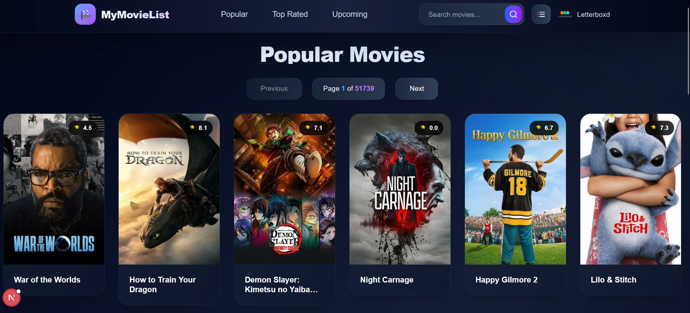
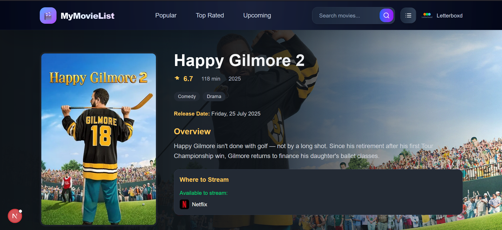
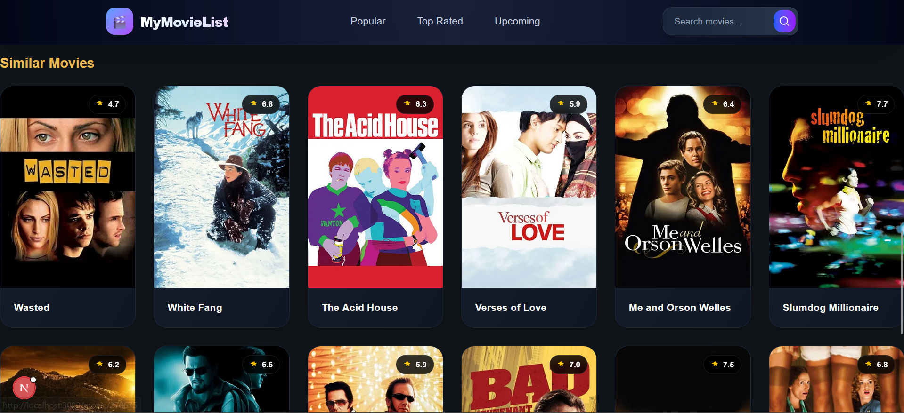
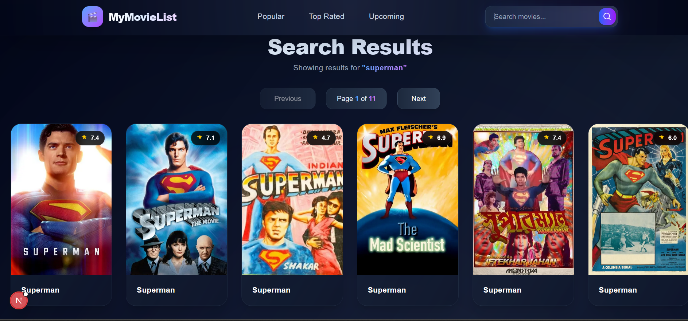
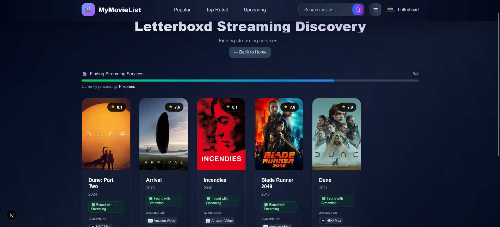

# MyMovieList

**MyMovieList** is a modern movie web application built using Next.js 15 and Tailwind CSS. It leverages the TMDb (The Movie Database) API to deliver real-time information on popular, upcoming, and top-rated movies. Users can explore detailed movie pages featuring cast information and similar movie suggestions — all wrapped in a sleek, cinematic UI.

The app also features a magnet link discovery tool, allowing users to fetch magnet links for selected movies. Additionally, users can import Letterboxd lists by URL, automatically processing up to 20 movies to retrieve related metadata and corresponding magnet links.

---

## 🚀 Overview

**MyMovieList** offers an immersive browsing experience, inspired by leading streaming platforms. With powerful search capabilities, responsive design, and rich movie data, it provides a seamless movie discovery experience optimized for desktop usage.

---

## 🎬 Features

### ✅ Browse by Categories

- Popular Movies
- Top-Rated Titles
- Upcoming Releases

### ✅ Magnet Link Finder

- Fetch magnet links for selected movies directly from search or detail pages

### Letterboxd Integration

- Import Letterboxd list URLs
- Automatically processes up to 20 movies for metadata and magnet link resolution

### 🔍 Smart Search

- Instant search results using query parameters
- Pagination for seamless navigation

### 🎞️ Movie Detail Pages

- High-resolution posters and backdrops
- Ratings, runtime, genres, and overview
- Full cast with profile images
- Suggestions for related/similar movies

### 💎 Premium UI/UX

- Dark, cinematic theme with gradients and blur effects
- Responsive grid layouts tailored for desktop
- Interactive hover states and smooth animations
- Accessibility-conscious design

### 🔒 Secure and Scalable

- API requests proxied through Next.js API routes to protect API keys
- Clean separation of frontend and backend logic

---

## 🛠 Tech Stack

- [Next.js 15](https://nextjs.org/) (App Router & Server Components)
- [Tailwind CSS](https://tailwindcss.com/) (Utility-first CSS framework)
- [TMDb API](https://www.themoviedb.org/documentation/api) (Movie Data Provider)

---

## 📸 Screenshots

### Home Page

### Movie Detail Page

### Similar Movies

### Search Results

### Letterboxd

---

> Build your own cinematic experience with **MyMovieList**.
